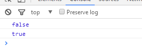
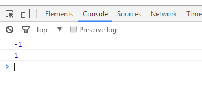
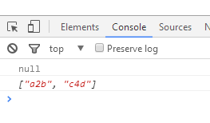
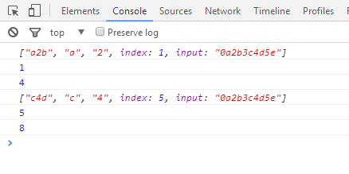
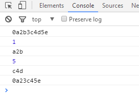
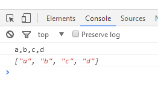
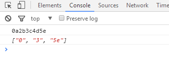
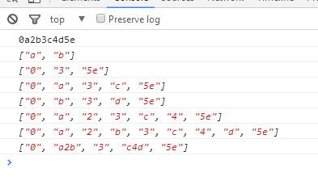

# js正则函数match、exec、test、search、replace、split的使用介绍

js正则函数test、search、match、exec、replace、split使用介绍:
1.test
test() 方法用于检测一个字符串是否匹配某个模式.
返回值
如果字符串 string 中含有与 RegExpObject 匹配的文本，则返回 true，否则返回 false。
例：
var str1 = "000";
var str2 = "0a2b3c4d5e";
var pattern = /([a-z])(\d)[a-z]/g;
console.log(pattern.test(str1));
console.log(pattern.test(str2));

2.search
search() 方法用于检索字符串中指定的子字符串，或检索与正则表达式相匹配的子字符串。
返回值
stringObject 中第一个与 regexp 相匹配的子串的起始位置。
注释：如果没有找到任何匹配的子串，则返回 -1。
说明
search() 方法不执行全局匹配，它将忽略标志 g。它同时忽略 regexp 的 lastIndex 属性，并且总是从字符串的开始进行检索，这意味着它总是返回 stringObject 的第一个匹配的位置。
例：
var str1 = "000";
var str2 = "0a2b3c4d5e";
var pattern = /([a-z])(\d)[a-z]/g;
//console.log(pattern.test(str1));
//console.log(pattern.test(str2));

console.log(str1.search(pattern));
console.log(str2.search(pattern));

3.match
match() 方法可在字符串内检索指定的值，或找到一个或多个正则表达式的匹配。
返回值
存放匹配结果的数组。该数组的内容依赖于 regexp 是否具有全局标志 g。
说明
match() 方法将检索字符串 stringObject，以找到一个或多个与 regexp 匹配的文本。这个方法的行为在很大程度上有赖于 regexp 是否具有标志 g。
如果 regexp 没有标志 g，那么 match() 方法就只能在 stringObject 中执行一次匹配。如果没有找到任何匹配的文本， match() 将返回 null。否则，它将返回一个数组，其中存放了与它找到的匹配文本有关的信息。该数组的第 0 个元素存放的是匹配文本，而其余的元素存放的是与正则表达式的子表达式匹配的文本。除了这些常规的数组元素之外，返回的数组还含有两个对象属性。 index 属性声明的是匹配文本的起始字符在 stringObject 中的位置，input 属性声明的是对 stringObject 的引用。
如果 regexp 具有标志 g，则 match() 方法将执行全局检索，找到 stringObject 中的所有匹配子字符串。若没有找到任何匹配的子串，则返回 null。如果找到了一个或多个匹配子串，则返回一个数组。不过全局匹配返回的数组的内容与前者大不相同，它的数组元素中存放的是 stringObject 中所有的匹配子串，而且也没有 index 属性或 input 属性。
例：
var str1 = "000";
var str2 = "0a2b3c4d5e";
var pattern = /([a-z])(\d)[a-z]/g;
console.log(str1.match(pattern));
console.log(str2.match(pattern));

注意：在全局检索模式下，match() 即不提供与子表达式匹配的文本的信息，也不声明每个匹配子串的位置。如果您需要这些全局检索的信息，可以使用下面介绍的exec()。

4.exec
exec() 方法用于检索字符串中的正则表达式的匹配。
返回值
返回一个数组，其中存放匹配的结果。如果未找到匹配，则返回值为 null。
说明
exec() 方法的功能非常强大，它是一个通用的方法，而且使用起来也比 test() 方法以及支持正则表达式的 String 对象的方法更为复杂。
如果 exec() 找到了匹配的文本，则返回一个结果数组。否则，返回 null。此数组的第 0 个元素是与正则表达式相匹配的文本，第 1 个元素是与 RegExpObject 的第 1 个子表达式相匹配的文本（如果有的话），第 2 个元素是与 RegExpObject 的第 2 个子表达式相匹配的文本（如果有的话），以此类推。除了数组元素和 length 属性之外，exec() 方法还返回两个属性。index 属性声明的是匹配文本的第一个字符的位置。input 属性则存放的是被检索的字符串 string。我们可以看得出，在调用非全局的 RegExp 对象的 exec() 方法时，返回的数组与调用方法 String.match() 返回的数组是相同的。
但是，当 RegExpObject 是一个全局正则表达式时，exec() 的行为就稍微复杂一些。它会在 RegExpObject 的 lastIndex 属性指定的字符处开始检索字符串 string。当 exec() 找到了与表达式相匹配的文本时，在匹配后，它将把 RegExpObject 的 lastIndex 属性设置为匹配文本的最后一个字符的下一个位置。这就是说，您可以通过反复调用 exec() 方法来遍历字符串中的所有匹配文本。当 exec() 再也找不到匹配的文本时，它将返回 null，并把 lastIndex 属性重置为 0。
提示和注释
重要事项：如果在一个字符串中完成了一次模式匹配之后要开始检索新的字符串，就必须手动地把 lastIndex 属性重置为 0。

有没有看晕，哈哈，还是看例子吧！

例1：
var str1 = "000";
var str2 = "0a2b3c4d5e";
var pattern = /([a-z])(\d)[a-z]/g;
console.log(pattern.exec(str2));
console.log(pattern.exec(str2));

例2：
var str1 = "000";
var str2 = "0a2b3c4d5e";
var pattern = /([a-z])(\d)[a-z]/g;

while ((result2 = pattern.exec(str2)) != null)  {
  console.log(result2);
  console.log(result2.index);
  console.log(pattern.lastIndex);
}

5.replace
replace() 方法用于在字符串中用一些字符替换另一些字符，或替换一个与正则表达式匹配的子串。
返回值
一个新的字符串，是用 replacement 替换了 regexp 的第一次匹配或所有匹配之后得到的。
说明
字符串 stringObject 的 replace() 方法执行的是查找并替换的操作。它将在 stringObject 中查找与 regexp 相匹配的子字符串，然后用 replacement 来替换这些子串。如果 regexp 具有全局标志 g，那么 replace() 方法将替换所有匹配的子串。否则，它只替换第一个匹配子串。
replacement 可以是字符串，也可以是函数。如果它是字符串，那么每个匹配都将由字符串替换。但是 replacement 中的 $ 字符具有特定的含义。如下表所示，它说明从模式匹配得到的字符串将用于替换。

例1：
var str1 = "000";
var str2 = "0a2b3c4d5e";
var pattern = /([a-z])(\d)[a-z]/g;

console.log(str2);
console.log(str2.replace(pattern,'s'));
console.log(str2.replace(pattern,'$1'));

例2：
var str1 = "000";
var str2 = "0a2b3c4d5e";
var pattern = /([a-z])(\d)[a-z]/g;

console.log(str2);
console.log(str2.replace(pattern,function(match,$1,index,origin){
	console.log(index)
	console.log(match)
	return $1;
}));
[图片]
例3：
var str2 = "0a2b3c4d5e";
var pattern = /([a-z])(\d)[a-z]/g;

console.log(str2);
console.log(str2.replace(pattern,function(match,group1,group2,index,origin){
	console.log(index)
	console.log(match)
	num = parseInt(group2); + 1;
	return group1 + num;
}));

6.split
split() 方法用于把一个字符串分割成字符串数组。
返回值
一个字符串数组。该数组是通过在 separator 指定的边界处将字符串 stringObject 分割成子串创建的。返回的数组中的字串不包括 separator 自身。
但是，如果 separator 是包含子表达式的正则表达式，那么返回的数组中包括与这些子表达式匹配的字串（但不包括与整个正则表达式匹配的文本）。
例1：
var str1 = "000";
var str2 = "a,b,c,d";

console.log(str2);
console.log(str2.split(','));

例2：
var str1 = "000";
var str2 = "0a2b3c4d5e";
var pattern = /[a-z]\d[a-z]/g;

console.log(str2);
console.log(str2.split(pattern));

最后来看个有趣的，
例3：
var str1 = "a,b,c,d";
var str2 = "0a2b3c4d5e";
var pattern5 = /\d/g;
var pattern = /[a-z]\d[a-z]/g;
var pattern1 = /([a-z])\d[a-z]/g;
var pattern2 = /[a-z]\d([a-z])/g;
var pattern3 = /([a-z])(\d)[a-z]/g;
var pattern4 = /([a-z])(\d)([a-z])/g;
var pattern5 = /([a-z]\d[a-z])/g;

console.log(str2);
console.log(str1.split(',',2));
console.log(str2.split(pattern));
console.log(str2.split(pattern1));
console.log(str2.split(pattern2));
console.log(str2.split(pattern3));
console.log(str2.split(pattern4));
console.log(str2.split(pattern5));

split第二个参数是限制数组长度，而正则如果使用了group（也就是小括号），返回数组也会把group里的字符包含进去

附：
js正则函数中需要转义的字符：* . ? + $ ^ [ ] ( ) { } | \ /