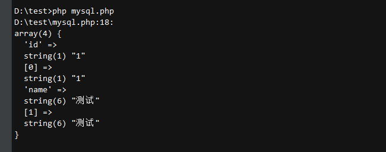
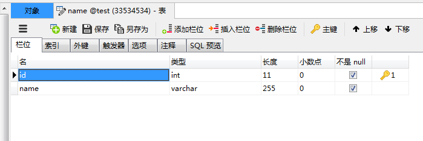
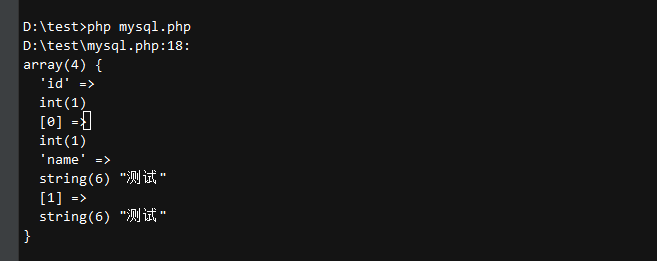

# PDO查询返回字符串？

标签（空格分隔）： PDO

---

直接上代码：

```
<?php
/**
 * Created by PhpStorm.
 * User: 13sai
 * Date: 2018/11/12
 * Time: 17:24
 */


try {
    $dbh = new PDO('mysql:host=localhost:3308;dbname=test', 'root', '');
    $rows = $dbh->query('select * from `name` limit 1');
    foreach ($rows as $row) {
        var_dump($row);
    }
} catch (PDOException $e) {
    die ("Error!: " . $e->getMessage() . "<br/>");
}
```
输出：



PDO查询数据出来为啥都是string类型，这不是我们需要的。数据库里明明就是


我们增加几个属性就能改变：
```
    $dbh = new PDO('mysql:host=localhost:3308;dbname=test', 'root', '');
    // 在创建连接后，加入这个
    $dbh->setAttribute(PDO::ATTR_STRINGIFY_FETCHES, false);
    $dbh->setAttribute(PDO::ATTR_EMULATE_PREPARES, false);
```
查看输出：


和数据库一致，收工！

另外mysqli也是可以通过配置实现这样的效果。


