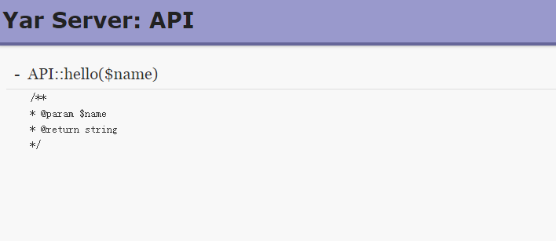

# 尝试yar

标签（空格分隔）： rpc，php

---

> RPC（Remote Procedure Call）—远程过程调用，它是一种通过网络从远程计算机程序上请求服务，而不需要了解底层网络技术的协议。RPC协议假定某些传输协议的存在，如TCP或UDP，为通信程序之间携带信息数据。在OSI网络通信模型中，RPC跨越了传输层和应用层。RPC使得开发包括网络分布式多程序在内的应用程序更加容易。php常见的有yar，phprpc。

今天我们来尝试yar，安装简单，安装扩展yar即可。

实例：
新建文件夹yar
```
<?php
/**
 * server.php
 * Created by PhpStorm.
 * User: 13sai
 * Date: 2018/11/3
 * Time: 14:43
 */


class API {
    /**
     * @param $name
     * @return string
     */
    public function hello($name){
        return "hello ".$name;
    }
}

$yar_server = new Yar_server(new API());
$yar_server->handle();
```
调用：
```
<?php
/**
 * Created by PhpStorm.
 * User: 13sai
 * Date: 2018/11/3
 * Time: 15:37
 */


$api = new Yar_Client("http://localhost/yar/server.php");
echo($api->hello('13sai'));
```

使用简单，我们也可以访问http://localhost/yar/server.php，可看到接口说明！



